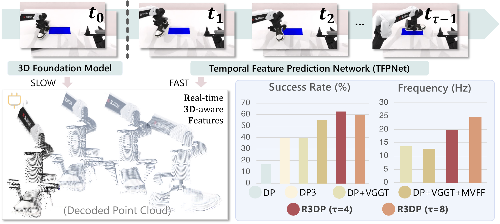

<h1 align="center">R3DP: Real-Time 3D-Aware Policy for<br>Embodied Manipulation</h1>

<p align="center">
  
</p>

<p align="center">
    Yuhao Zhang<sup>1,2*</sup>,
    Wanxi Dong<sup>3,4*</sup>,
    Yue Shi<sup>1*</sup>,
    Yi Liang<sup>1*</sup>,
    Jingnan Gao<sup>1</sup>,
    Qiaochu Yang<sup>1,4</sup>,
    Yaxing Lyu<sup>7</sup>,
    Zhixuan Liang<sup>5</sup>,
    <br>
    Yibin Liu<sup>8</sup>,
    Congsheng Xu<sup>1</sup>,
    Xianda Guo<sup>6,2</sup>,
    Wei Sui<sup>2</sup>,
    Yaohui Jin<sup>1</sup>,
    Xiaokang Yang<sup>1</sup>,
    Yanyan Xu<sup>1</sup>,
    Yao Mu<sup>1†</sup>
</p>

<p align="center">
    <sup>1</sup>Shanghai Jiao Tong University&emsp;
    <sup>2</sup>D-Robotics&emsp;
    <sup>3</sup>Southern University of Science and Technology&emsp;
    <sup>4</sup>Xspark AI
    <br>
    <sup>5</sup>The University of Hong Kong&emsp;
    <sup>6</sup>Wuhan University&emsp;
    <sup>7</sup>Xiamen University Malaysia&emsp;
    <sup>8</sup>Northeastern University
</p>

<p align="center">
    <sup>*</sup>Equal Contribution&emsp;&emsp;<sup>†</sup>Corresponding Author
</p>

<p align="center">
    <a href="https://dazazh.github.io/r3dp-project-page/"></a>&nbsp;
    <a href="https://arxiv.org/abs/2603.14498"></a>&nbsp;
    <!-- <a href="./LICENSE"></a> -->
</p>


## 📖 Overview

**R3DP** (Real-time 3D-aware Policy) offers a plug-and-play solution that injects the 3D priors of large-scale foundation models (e.g., [VGGT](https://github.com/facebookresearch/vggt)) into imitation-learning policies such as Diffusion Policy — **without sacrificing real-time control**. It endows RGB-only policies with strong spatial understanding while preserving the inherent strengths and speed of 2D policies, requiring no depth sensors or point-cloud rigs.

R3DP runs an **asynchronous fast–slow collaboration**: the slow branch queries the heavy 3D foundation model (VGGT) only on sparse key frames every `τ` steps, while a lightweight **Temporal Feature Prediction Network (TFPNet)** — distilled from VGGT and conditioned on historical frames — fills in 3D-aware features for all intermediate frames in real time. A **Multi-View Feature Fuser (MVFF)** then aggregates per-view features using camera intrinsics and extrinsics via cross-attention with [PRoPE](https://arxiv.org/abs/2506.09081)-style projective encoding, producing a spatially consistent representation that conditions the diffusion policy head.


## 🛠️ Installation

R3DP runs inside the RoboTwin simulation environment. Installation has two parts: (1) the base RoboTwin environment, and (2) the R3DP policy and its 3D backbone.

### 1. Base environment (RoboTwin)

Follow [INSTALLATION.md](./INSTALLATION.md) for the full RoboTwin setup (conda env, SAPIEN, `mplib` patches, and asset download). In short:

```bash
conda create -n r3dp python=3.8
conda activate r3dp

pip install torch==2.4.1 torchvision sapien==3.0.0b1 scipy==1.10.1 mplib==0.1.1 \
    gymnasium==0.29.1 trimesh==4.4.3 open3d==0.18.0 imageio==2.34.2 pydantic \
    zarr openai huggingface_hub==0.25.0

cd third_party/pytorch3d_simplified && pip install -e . && cd ../..

# Download simulation assets
python ./script/download_asset.py
unzip aloha_urdf.zip && unzip main_models.zip
```

> ⚠️ Don't forget the **`mplib` library patches** described in [INSTALLATION.md](./INSTALLATION.md) — they are required for the planner to work.

### 2. R3DP policy and 3D backbone

```bash
cd policy/R3DP

cd vggt && pip install -e . && cd ..

pip install -e .

pip install wandb hydra-core==1.2.0 diffusers==0.11.1 einops accelerate timm
```

### 3. Prepare model weights

**(a) Foundation weights**:

| Weight | Source | Place at |
|---|---|---|
| VGGT backbone | https://github.com/facebookresearch/vggt | `policy/R3DP/vggt/ckpt/` |
| DINOv2-S | https://github.com/facebookresearch/dinov2 | `policy/R3DP/tvggt/pretrain_ckpt/` |

**(b) R3DP weights**:

| Weight | Source | Place at |
|---|---|---|
| TFPNet | https://dazazh.github.io/r3dp-project-page/ | `policy/R3DP/tvggt/checkpoints/` |
| R3DP | https://dazazh.github.io/r3dp-project-page/ | `policy/R3DP/checkpoints/` |


## 🚀 Usage

### 1. Collect expert data

Generate expert demonstrations for a task using RoboTwin's automated collectors:

```bash
bash run_task.sh ${task_name} ${gpu_id}
# e.g.
bash run_task.sh block_hammer_beat 0
```

### 2. Train R3DP

```bash
cd policy/R3DP
bash train.sh ${task_name} ${head_camera_type} ${expert_data_num} ${seed} ${gpu_ids}
# e.g. train on 4 GPUs
bash train.sh block_hammer_beat L515 100 0 0,1,2,3
```

The script automatically converts `.pkl` demonstrations into a `.zarr` dataset (via `script/pkl2zarr_r3dp.py`) if it does not already exist, then launches multi-GPU training with `accelerate`. Checkpoints are written to `policy/R3DP/checkpoints/`.

### 3. Evaluate

```bash
cd policy/R3DP
bash eval_r3dp.sh ${task_name} ${head_camera_type} ${expert_data_num} ${checkpoint_num} ${seed} ${gpu_id} ${tau}
# e.g.
bash eval_r3dp.sh block_hammer_beat L515 100 100 0 0 4
```

Here **`tau` (τ)** controls the fast–slow schedule — how often the slow VGGT branch is queried. Larger `τ` → faster inference; smaller `τ` → slightly higher accuracy. R3DP is robust across a wide range of `τ`.

## 🙏 Acknowledgements

R3DP is built upon several excellent open-source projects:

- [RoboTwin](https://github.com/TianxingChen/RoboTwin) — dual-arm manipulation benchmark and simulation environment.
- [VGGT](https://github.com/facebookresearch/vggt) — the 3D vision foundation model used as our slow branch.
- [Diffusion Policy](https://github.com/real-stanford/diffusion_policy) — the base visuomotor policy.
- [DINOv2](https://github.com/facebookresearch/dinov2) — visual backbone for TFPNet.

We thank the authors for making their work publicly available.

## 📝 Citation

If you find R3DP useful in your research, please consider citing:

```bibtex
@article{r3dp2025,
  title={R3DP: Real-Time 3D-Aware Policy for Embodied Manipulation},
  author={Zhang, Yuhao and Dong, Wanxi and Shi, Yue and Liang, Yi and Gao, Jingnan and Yang, Qiaochu and Lyu, Yaxing and Liang, Zhixuan and Liu, Yibin and Xu, Congsheng and Guo, Xianda and Sui, Wei and Jin, Yaohui and Yang, Xiaokang and Xu, Yanyan and Mu, Yao},
  journal={arXiv preprint},
  year={2025}
}
```

<!--
## 📄 License

This project is released under the [MIT License](./LICENSE).
-->
